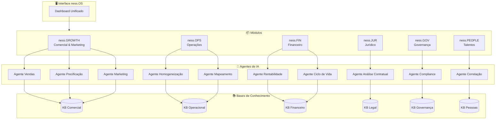
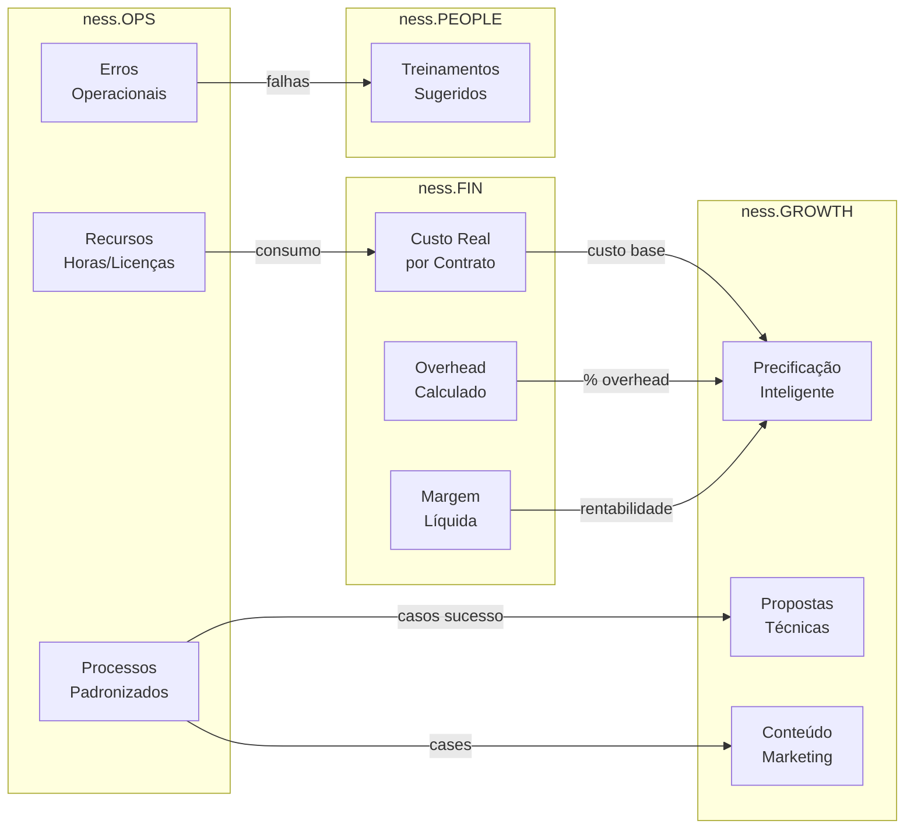
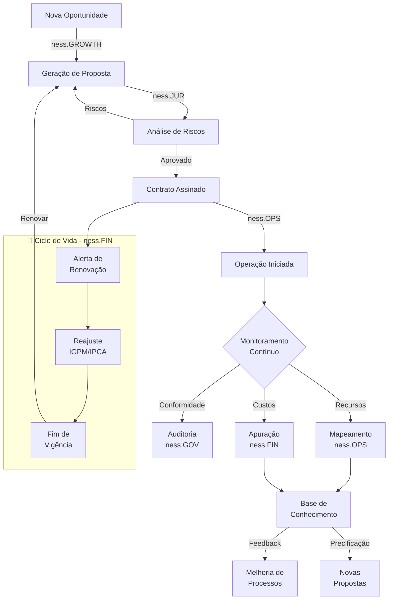
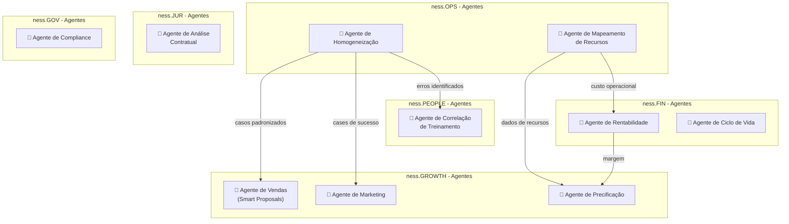
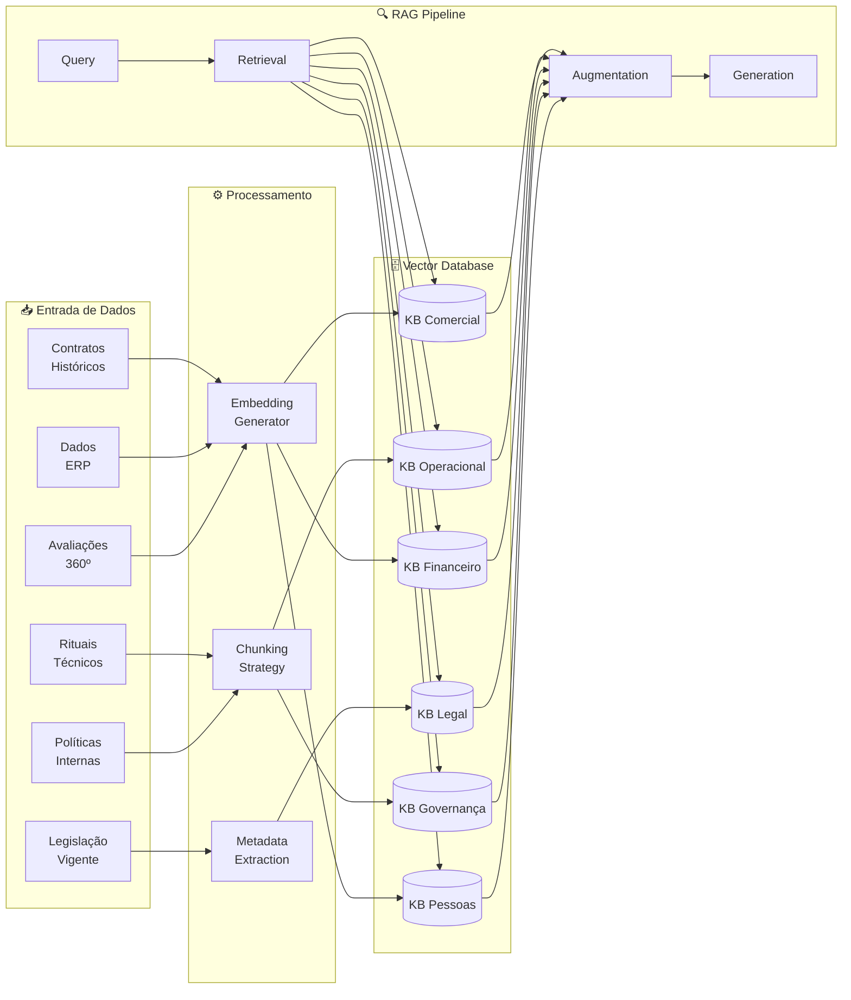
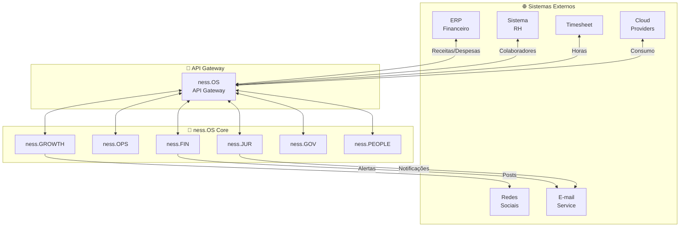
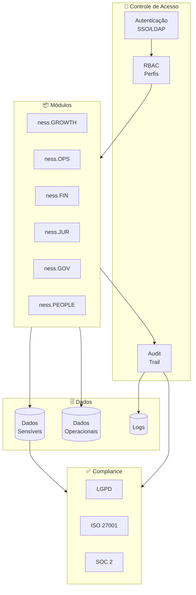
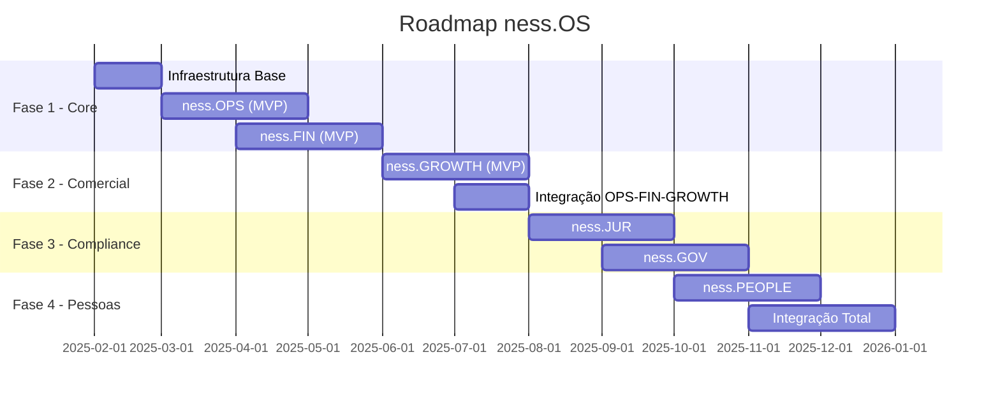

# Diagramas do ness.OS

## 1. Arquitetura Geral do Sistema

## 2. Fluxo de Dados entre Módulos

## 3. Ciclo de Vida do Contrato

## 4. Arquitetura dos Agentes

## 5. Bases de Conhecimento e RAG

## 6. Integrações Externas

## 7. Modelo de Segurança e Governança

## 8. Roadmap de Implementação

---

> **Nota:** Todos os diagramas utilizam Mermaid e podem ser renderizados diretamente no GitHub, GitLab, ou qualquer visualizador compatível.
