# Diagramas do ness.OS

## 1. Arquitetura Geral do Sistema

```mermaid
flowchart TB
    subgraph Frontend["🖥️ Interface ness.OS"]
        UI[Dashboard Unificado]
    end

    subgraph Modules["📦 Módulos"]
        GROWTH[ness.GROWTH<br/>Comercial & Marketing]
        OPS[ness.OPS<br/>Operações]
        FIN[ness.FIN<br/>Financeiro]
        JUR[ness.JUR<br/>Jurídico]
        GOV[ness.GOV<br/>Governança]
        PEOPLE[ness.PEOPLE<br/>Talentos]
    end

    subgraph Agents["🤖 Agentes de IA"]
        A1[Agente Vendas]
        A2[Agente Precificação]
        A3[Agente Marketing]
        A4[Agente Homogeneização]
        A5[Agente Mapeamento]
        A6[Agente Rentabilidade]
        A7[Agente Ciclo de Vida]
        A8[Agente Análise Contratual]
        A9[Agente Compliance]
        A10[Agente Correlação]
    end

    subgraph KB["📚 Bases de Conhecimento"]
        KB1[(KB Comercial)]
        KB2[(KB Operacional)]
        KB3[(KB Financeiro)]
        KB4[(KB Legal)]
        KB5[(KB Governança)]
        KB6[(KB Pessoas)]
    end

    UI --> Modules
    
    GROWTH --> A1 & A2 & A3
    OPS --> A4 & A5
    FIN --> A6 & A7
    JUR --> A8
    GOV --> A9
    PEOPLE --> A10

    A1 & A2 & A3 --> KB1
    A4 & A5 --> KB2
    A6 & A7 --> KB3
    A8 --> KB4
    A9 --> KB5
    A10 --> KB6
```

## 2. Fluxo de Dados entre Módulos

```mermaid
flowchart LR
    subgraph OPS["ness.OPS"]
        R[Recursos<br/>Horas/Licenças]
        P[Processos<br/>Padronizados]
        E[Erros<br/>Operacionais]
    end

    subgraph FIN["ness.FIN"]
        C[Custo Real<br/>por Contrato]
        M[Margem<br/>Líquida]
        O[Overhead<br/>Calculado]
    end

    subgraph GROWTH["ness.GROWTH"]
        PR[Precificação<br/>Inteligente]
        PP[Propostas<br/>Técnicas]
        MK[Conteúdo<br/>Marketing]
    end

    subgraph PEOPLE["ness.PEOPLE"]
        T[Treinamentos<br/>Sugeridos]
    end

    R -->|consumo| C
    C -->|custo base| PR
    O -->|% overhead| PR
    P -->|casos sucesso| PP
    P -->|cases| MK
    E -->|falhas| T
    M -->|rentabilidade| PR
```

## 3. Ciclo de Vida do Contrato

```mermaid
flowchart TD
    A[Nova Oportunidade] -->|ness.GROWTH| B[Geração de Proposta]
    B -->|ness.JUR| C[Análise de Riscos]
    C -->|Aprovado| D[Contrato Assinado]
    C -->|Riscos| B
    
    D -->|ness.OPS| E[Operação Iniciada]
    E --> F{Monitoramento<br/>Contínuo}
    
    F -->|Recursos| G[Mapeamento<br/>ness.OPS]
    F -->|Custos| H[Apuração<br/>ness.FIN]
    F -->|Conformidade| I[Auditoria<br/>ness.GOV]
    
    G --> J[Base de<br/>Conhecimento]
    H --> J
    
    J -->|Feedback| K[Melhoria de<br/>Processos]
    J -->|Precificação| L[Novas<br/>Propostas]
    
    subgraph Ciclo["🔄 Ciclo de Vida - ness.FIN"]
        M[Alerta de<br/>Renovação]
        N[Reajuste<br/>IGPM/IPCA]
        O[Fim de<br/>Vigência]
    end
    
    D --> M
    M --> N
    N --> O
    O -->|Renovar| B
```

## 4. Arquitetura dos Agentes

## 5. Bases de Conhecimento e RAG

```mermaid
flowchart LR
    subgraph Input["📥 Entrada de Dados"]
        D1[Contratos<br/>Históricos]
        D2[Rituais<br/>Técnicos]
        D3[Dados<br/>ERP]
        D4[Legislação<br/>Vigente]
        D5[Políticas<br/>Internas]
        D6[Avaliações<br/>360º]
    end

    subgraph Processing["⚙️ Processamento"]
        E1[Embedding<br/>Generator]
        E2[Chunking<br/>Strategy]
        E3[Metadata<br/>Extraction]
    end

    subgraph VectorDB["🗄️ Vector Database"]
        V1[(KB Comercial)]
        V2[(KB Operacional)]
        V3[(KB Financeiro)]
        V4[(KB Legal)]
        V5[(KB Governança)]
        V6[(KB Pessoas)]
    end

    subgraph RAG["🔍 RAG Pipeline"]
        Q[Query]
        R[Retrieval]
        A[Augmentation]
        G[Generation]
    end

    D1 --> E1 --> V1
    D2 --> E2 --> V2
    D3 --> E1 --> V3
    D4 --> E3 --> V4
    D5 --> E2 --> V5
    D6 --> E1 --> V6

    Q --> R
    R --> V1 & V2 & V3 & V4 & V5 & V6
    V1 & V2 & V3 & V4 & V5 & V6 --> A
    A --> G
```

## 6. Integrações Externas

```mermaid
flowchart TB
    subgraph External["🌐 Sistemas Externos"]
        ERP[ERP<br/>Financeiro]
        RH[Sistema<br/>RH]
        TS[Timesheet]
        CLOUD[Cloud<br/>Providers]
        SOCIAL[Redes<br/>Sociais]
        EMAIL[E-mail<br/>Service]
    end

    subgraph Gateway["🚪 API Gateway"]
        API[ness.OS<br/>API Gateway]
    end

    subgraph Core["🧠 ness.OS Core"]
        GROWTH[ness.GROWTH]
        OPS[ness.OPS]
        FIN[ness.FIN]
        JUR[ness.JUR]
        GOV[ness.GOV]
        PEOPLE[ness.PEOPLE]
    end

    ERP <-->|Receitas/Despesas| API
    RH <-->|Colaboradores| API
    TS <-->|Horas| API
    CLOUD <-->|Consumo| API

    API <--> GROWTH
    API <--> OPS
    API <--> FIN
    API <--> JUR
    API <--> GOV
    API <--> PEOPLE

    GROWTH -->|Posts| SOCIAL
    FIN -->|Alertas| EMAIL
    JUR -->|Notificações| EMAIL
```

## 7. Modelo de Segurança e Governança

```mermaid
flowchart TB
    subgraph Access["🔐 Controle de Acesso"]
        AUTH[Autenticação<br/>SSO/LDAP]
        RBAC[RBAC<br/>Perfis]
        AUDIT[Audit<br/>Trail]
    end

    subgraph Modules["📦 Módulos"]
        M1[ness.GROWTH]
        M2[ness.OPS]
        M3[ness.FIN]
        M4[ness.JUR]
        M5[ness.GOV]
        M6[ness.PEOPLE]
    end

    subgraph Data["🗄️ Dados"]
        D1[(Dados<br/>Sensíveis)]
        D2[(Dados<br/>Operacionais)]
        D3[(Logs)]
    end

    AUTH --> RBAC
    RBAC --> Modules
    Modules --> D1 & D2
    Modules --> AUDIT
    AUDIT --> D3

    subgraph Compliance["✅ Compliance"]
        LGPD[LGPD]
        ISO[ISO 27001]
        SOC[SOC 2]
    end

    D1 --> Compliance
    AUDIT --> Compliance
```

## 8. Roadmap de Implementação

---

> **Nota:** Todos os diagramas utilizam Mermaid e podem ser renderizados diretamente no GitHub, GitLab, ou qualquer visualizador compatível.
