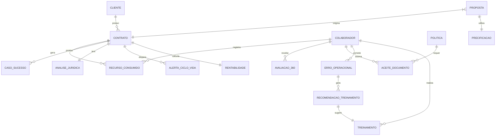

# Modelo de Dados Conceitual

## Visão Geral

Este documento descreve o modelo de dados conceitual do ness.OS, incluindo entidades principais, relacionamentos e schemas das bases de conhecimento.

## Diagrama Entidade-Relacionamento



## Entidades Principais

### 1. Cliente

```yaml
Cliente:
  id: UUID
  razao_social: String
  nome_fantasia: String
  cnpj: String (unique)
  setor: Enum [SAUDE, ENERGIA, FINANCEIRO, VAREJO, INDUSTRIA, OUTROS]
  porte: Enum [MICRO, PEQUENA, MEDIA, GRANDE]
  endereco:
    logradouro: String
    cidade: String
    estado: String
    cep: String
  contatos: List[Contato]
  data_cadastro: DateTime
  status: Enum [ATIVO, INATIVO, PROSPECT]
  
Contato:
  nome: String
  cargo: String
  email: String
  telefone: String
  tipo: Enum [TECNICO, COMERCIAL, FINANCEIRO, DECISOR]
```

### 2. Contrato

```yaml
Contrato:
  id: UUID
  cliente_id: UUID (FK)
  numero: String (unique)
  tipo: Enum [MSS, PROJETO, CONSULTORIA, HIBRIDO]
  
  vigencia:
    data_inicio: Date
    data_fim: Date
    renovacao_automatica: Boolean
    indice_reajuste: Enum [IGPM, IPCA, INPC]
  
  valores:
    valor_mensal: Decimal
    valor_total: Decimal
    moeda: String (default: BRL)
  
  escopo:
    descricao: Text
    servicos: List[String]
    sla: SLA
    
  documentos:
    contrato_assinado: URL
    aditivos: List[URL]
    
  status: Enum [ATIVO, SUSPENSO, ENCERRADO, EM_RENOVACAO]
  created_at: DateTime
  updated_at: DateTime

SLA:
  disponibilidade_minima: Decimal (ex: 99.5)
  tempo_resposta_critico: Integer (minutos)
  tempo_resposta_alto: Integer (minutos)
  tempo_resposta_medio: Integer (minutos)
  tempo_resposta_baixo: Integer (minutos)
  penalidades: List[Penalidade]
```

### 3. Colaborador

```yaml
Colaborador:
  id: UUID
  nome: String
  email: String (unique)
  matricula: String (unique)
  cargo: String
  departamento: String
  gestor_id: UUID (FK, nullable)
  
  dados_profissionais:
    data_admissao: Date
    tipo_contrato: Enum [CLT, PJ, ESTAGIO]
    custo_hora: Decimal
    
  competencias: List[Competencia]
  certificacoes: List[Certificacao]
  
  status: Enum [ATIVO, FERIAS, AFASTADO, DESLIGADO]
  created_at: DateTime
  updated_at: DateTime

Competencia:
  nome: String
  nivel: Enum [BASICO, INTERMEDIARIO, AVANCADO, ESPECIALISTA]
  ultima_avaliacao: Date

Certificacao:
  nome: String
  emissor: String
  data_obtencao: Date
  data_validade: Date (nullable)
```

### 4. Recurso Consumido

```yaml
RecursoConsumido:
  id: UUID
  contrato_id: UUID (FK)
  periodo: String (YYYY-MM)
  
  horas:
    total: Decimal
    por_colaborador: Map[UUID, Decimal]
    por_categoria:
      incidentes: Decimal
      mudancas: Decimal
      projetos: Decimal
      
  licencas:
    - nome: String
      quantidade: Integer
      custo_unitario: Decimal
      
  cloud:
    provider: Enum [AWS, AZURE, GCP, OUTRO]
    compute_hours: Decimal
    storage_gb: Decimal
    custo_total: Decimal
    
  custo_total_apurado: Decimal
  created_at: DateTime
```

### 5. Proposta

```yaml
Proposta:
  id: UUID
  cliente_id: UUID (FK)
  numero: String (unique)
  
  escopo:
    descricao: Text
    servicos: List[String]
    premissas: List[String]
    exclusoes: List[String]
    
  precificacao:
    custo_base: Decimal
    overhead_percent: Decimal
    margem_percent: Decimal
    risco_sla_percent: Decimal
    valor_final: Decimal
    
  documentos:
    proposta_tecnica: URL
    proposta_comercial: URL
    
  status: Enum [RASCUNHO, ENVIADA, EM_NEGOCIACAO, GANHA, PERDIDA]
  data_envio: DateTime (nullable)
  data_resposta: DateTime (nullable)
  motivo_perda: String (nullable)
  
  created_at: DateTime
  updated_at: DateTime
```

### 6. Análise Jurídica

```yaml
AnaliseJuridica:
  id: UUID
  contrato_id: UUID (FK)
  documento_analisado: URL
  
  resultado:
    status: Enum [APROVADO, RESSALVAS, BLOQUEADO]
    score_risco: Decimal (0-10)
    
  riscos: List[RiscoIdentificado]
  
  parecer: Text
  recomendacoes: List[String]
  
  analisado_por: String (agente ou humano)
  data_analise: DateTime

RiscoIdentificado:
  categoria: Enum [SLA, MULTA, LGPD, RESCISAO, PI, FORO, RESPONSABILIDADE]
  clausula: String
  texto_original: Text
  descricao_risco: Text
  severidade: Enum [BAIXA, MEDIA, ALTA, CRITICA]
  sugestao: Text
  fundamentacao: Text
```

### 7. Erro Operacional

```yaml
ErroOperacional:
  id: UUID
  contrato_id: UUID (FK)
  colaborador_id: UUID (FK)
  
  detalhes:
    tipo: Enum [BACKUP, PATCH, SEGURANCA, SLA, DOCUMENTACAO, COMUNICACAO, CONFIGURACAO]
    descricao: Text
    impacto: Enum [BAIXO, MEDIO, ALTO, CRITICO]
    data_ocorrencia: DateTime
    
  root_cause:
    categoria: Enum [PROCESSO, CONHECIMENTO, FERRAMENTA, COMUNICACAO]
    descricao: Text
    
  resolucao:
    acao_tomada: Text
    tempo_resolucao: Integer (minutos)
    preventiva: Text
    
  gerou_treinamento: Boolean
  recomendacao_id: UUID (FK, nullable)
  
  created_at: DateTime
```

### 8. Avaliação 360º

```yaml
Avaliacao360:
  id: UUID
  colaborador_id: UUID (FK)
  ciclo: String (ex: 2024-S2)
  
  scores:
    tecnicas:
      conhecimento: Decimal (1-5)
      resolucao_problemas: Decimal (1-5)
      qualidade: Decimal (1-5)
    comportamentais:
      comunicacao: Decimal (1-5)
      trabalho_equipe: Decimal (1-5)
      proatividade: Decimal (1-5)
    resultados:
      entrega: Decimal (1-5)
      prazos: Decimal (1-5)
      metas: Decimal (1-5)
      
  score_geral: Decimal
  
  avaliacoes:
    - avaliador_tipo: Enum [AUTO, GESTOR, PAR, CLIENTE_INTERNO]
      avaliador_id: UUID (nullable, anônimo para pares)
      scores: Map[String, Decimal]
      feedback_qualitativo: Text
      
  pontos_fortes: List[String]
  areas_desenvolvimento: List[String]
  
  created_at: DateTime
```

### 9. Política e Aceite

```yaml
Politica:
  id: UUID
  nome: String
  versao: String
  
  conteudo:
    texto: Text
    documento: URL
    hash: String (SHA256)
    
  publico_alvo: List[String] (departamentos ou "TODOS")
  obrigatoria: Boolean
  
  validade:
    data_publicacao: DateTime
    validade_meses: Integer (nullable, se renovação periódica)
    
  status: Enum [RASCUNHO, VIGENTE, OBSOLETA]
  created_at: DateTime
  updated_at: DateTime

AceiteDocumento:
  id: UUID
  colaborador_id: UUID (FK)
  politica_id: UUID (FK)
  
  aceite:
    data_aceite: DateTime
    ip_origem: String
    user_agent: String
    geolocalizacao: String (nullable)
    metodo: Enum [CHECKBOX, PIN, ASSINATURA_DIGITAL]
    
  hash_documento: String (snapshot do documento aceito)
  valido_ate: Date (nullable)
  
  created_at: DateTime
```

### 10. Treinamento e Recomendação

```yaml
Treinamento:
  id: UUID
  nome: String
  descricao: Text
  
  detalhes:
    competencias: List[String]
    carga_horaria: Integer (horas)
    modalidade: Enum [PRESENCIAL, ONLINE_SINCRONO, ONLINE_ASSINCRONO, HIBRIDO]
    fornecedor: String
    custo: Decimal
    
  pre_requisitos: List[String]
  certificacao: Boolean
  
  status: Enum [ATIVO, INATIVO]
  created_at: DateTime

RecomendacaoTreinamento:
  id: UUID
  colaborador_id: UUID (FK)
  treinamento_id: UUID (FK)
  
  origem:
    tipo: Enum [ERRO_OPERACIONAL, AVALIACAO_360, MANUAL, PDI]
    referencia_id: UUID (nullable)
    descricao: Text
    
  gap_identificado: String
  evidencias: List[String]
  
  prioridade: Enum [BAIXA, MEDIA, ALTA, URGENTE]
  prazo_conclusao: Date
  
  status: Enum [PENDENTE_APROVACAO, APROVADA, REJEITADA, EM_ANDAMENTO, CONCLUIDA, CANCELADA]
  
  aprovacao:
    aprovador_id: UUID (nullable)
    data_aprovacao: DateTime (nullable)
    observacoes: Text (nullable)
    
  created_at: DateTime
  updated_at: DateTime
```

## Bases de Conhecimento (Vector DB)

### Schema de Documento para RAG

```yaml
DocumentoRAG:
  id: UUID
  
  metadata:
    tipo: Enum [CONTRATO, CASO_SUCESSO, MANUAL, POLITICA, LEGISLACAO]
    modulo: Enum [GROWTH, OPS, FIN, JUR, GOV, PEOPLE]
    titulo: String
    fonte: String
    data_criacao: DateTime
    data_atualizacao: DateTime
    tags: List[String]
    
  conteudo:
    texto_original: Text
    chunks: List[Chunk]
    
Chunk:
  id: UUID
  documento_id: UUID (FK)
  texto: Text
  embedding: Vector[Float] (dimensão depende do modelo)
  posicao: Integer
  metadata:
    secao: String (nullable)
    pagina: Integer (nullable)
```

### Índices por Base de Conhecimento

| Base | Tipos de Documento | Uso Principal |
|------|-------------------|---------------|
| KB_COMERCIAL | Contratos de sucesso, Propostas ganhas | Smart Proposals |
| KB_OPERACIONAL | Manuais, Procedimentos, Cases | Homogeneização |
| KB_FINANCEIRO | Tabelas de custo, Histórico | Rentabilidade |
| KB_LEGAL | LGPD, Marco Civil, Jurisprudência | Análise contratual |
| KB_GOVERNANCA | Políticas, Termos, NDAs | Compliance |
| KB_PESSOAS | Catálogo de treinamentos | Correlação |

## Considerações de Implementação

### Tecnologias Sugeridas

| Componente | Tecnologia | Justificativa |
|------------|------------|---------------|
| Banco relacional | PostgreSQL | Robusto, suporta JSON |
| Vector DB | Qdrant / Pinecone | Performance para RAG |
| Cache | Redis | Session e cache de cálculos |
| Object Storage | MinIO / S3 | Documentos e arquivos |
| Search | Elasticsearch | Full-text search |

### Particionamento

- **Recursos consumidos:** Por mês (período)
- **Logs/Auditoria:** Por mês
- **Aceites:** Por ano

### Retenção de Dados

| Tipo de Dado | Retenção | Motivo |
|--------------|----------|--------|
| Contratos | 10 anos | Legal |
| Aceites | 5 anos após desligamento | LGPD |
| Erros operacionais | 3 anos | Análise de tendências |
| Avaliações | 5 anos | Histórico de carreira |
| Logs de sistema | 1 ano | Auditoria |
