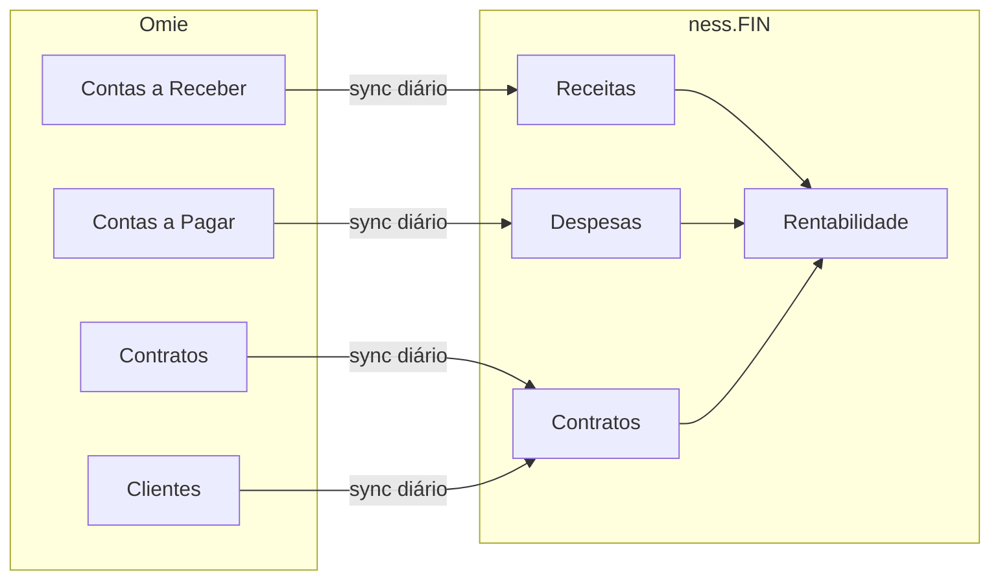

# Integração Omie ERP

> Mapeamento de APIs para o módulo ness.FIN

## Visão Geral

O [Omie](https://www.omie.com.br) é o ERP utilizado pela ness. para gestão financeira, faturamento e emissão de notas fiscais. Esta documentação especifica como o ness.OS se integra com as APIs do Omie para alimentar o módulo **ness.FIN** e demais módulos dependentes.

## Autenticação

Todas as requisições à API Omie requerem:

```json
{
  "app_key": "SUA_APP_KEY",
  "app_secret": "SUA_APP_SECRET",
  "call": "NomeDoMetodo",
  "param": [{ }]
}
```

- **Endpoint base:** `https://app.omie.com.br/api/v1/`
- **Protocolo:** JSON (recomendado) ou SOAP
- **Documentação oficial:** https://developer.omie.com.br/service-list/

## APIs Utilizadas

### 1. Finanças (Core do ness.FIN)

#### 1.1 Contas a Receber

**Endpoint:** `/financas/contareceber/`

| Método | Descrição | Uso no ness.FIN |
|--------|-----------|-----------------|
| `ListarContasReceber` | Lista títulos a receber | Receita por cliente/contrato |
| `ConsultarContaReceber` | Detalhe de um título | Verificação de status |
| `IncluirContaReceber` | Cria título | Lançamentos manuais |

**Exemplo de requisição:**
```json
{
  "app_key": "999999999",
  "app_secret": "xxxxxxxxxxxxxx",
  "call": "ListarContasReceber",
  "param": [{
    "pagina": 1,
    "registros_por_pagina": 100,
    "filtrar_por_cliente": 123456789,
    "filtrar_por_status": "RECEBIDO"
  }]
}
```

**Campos relevantes da resposta:**
```json
{
  "codigo_lancamento_omie": 123456,
  "codigo_cliente_fornecedor": 789,
  "numero_documento": "NF-001",
  "data_vencimento": "15/02/2025",
  "valor_documento": 5000.00,
  "valor_recebido": 5000.00,
  "status_titulo": "RECEBIDO",
  "codigo_categoria": "1.01.01",
  "id_conta_corrente": 12345
}
```

#### 1.2 Contas a Pagar

**Endpoint:** `/financas/contapagar/`

| Método | Descrição | Uso no ness.FIN |
|--------|-----------|-----------------|
| `ListarContasPagar` | Lista títulos a pagar | Despesas por categoria |
| `ConsultarContaPagar` | Detalhe de um título | Verificação de pagamento |

**Mapeamento de categorias para overhead:**
```
1.01.xx → Receitas (ignorar em despesas)
2.01.xx → Custos diretos
2.02.xx → Despesas operacionais (overhead)
2.03.xx → Despesas administrativas (overhead)
2.04.xx → Despesas com pessoal
```

#### 1.3 Extrato e Fluxo de Caixa

**Endpoint:** `/financas/extrato/`

| Método | Descrição | Uso no ness.FIN |
|--------|-----------|-----------------|
| `ListarExtrato` | Extrato da conta corrente | Conciliação bancária |

**Endpoint:** `/financas/caixa/`

| Método | Descrição | Uso no ness.FIN |
|--------|-----------|-----------------|
| `ListarResumoFluxoCaixa` | Previsto x Realizado | Dashboard financeiro |

#### 1.4 Movimentos Financeiros

**Endpoint:** `/financas/mf/`

| Método | Descrição | Uso no ness.FIN |
|--------|-----------|-----------------|
| `PesquisarMovFinanceiro` | Baixas e pagamentos | Histórico de transações |

---

### 2. Contratos de Serviço (Ciclo de Vida)

**Endpoint:** `/servicos/contrato/`

| Método | Descrição | Uso no ness.FIN |
|--------|-----------|-----------------|
| `ListarContratos` | Lista contratos ativos | Base de contratos |
| `ConsultarContrato` | Detalhe do contrato | Vigência, valores |
| `AlterarContrato` | Atualiza contrato | Reajustes |

**Campos críticos para Ciclo de Vida:**
```json
{
  "cabecalho": {
    "nCodCtr": 123456,
    "cCodIntCtr": "CTR-2025-001",
    "nCodCli": 789,
    "dDtInicio": "01/01/2025",
    "dDtFim": "31/12/2025",
    "dDtReajuste": "01/01/2026",
    "cCodReajuste": "IGPM"
  },
  "itensContrato": [{
    "nCodServico": 1,
    "nQtde": 1,
    "nValorUnit": 10000.00
  }],
  "informacoesAdicionais": {
    "cCodCateg": "1.02.01",
    "nCodProjeto": 456
  }
}
```

**Lógica de alertas:**
```
Se (dDtFim - HOJE) <= 90 dias → Alerta de renovação
Se (dDtReajuste - HOJE) <= 30 dias → Alerta de reajuste
Se status = "SUSPENSO" → Alerta de inadimplência
```

---

### 3. Ordens de Serviço

**Endpoint:** `/servicos/os/`

| Método | Descrição | Uso no ness.FIN |
|--------|-----------|-----------------|
| `ListarOS` | Lista ordens de serviço | Serviços avulsos |
| `ConsultarOS` | Detalhe da OS | Valores faturados |

---

### 4. Clientes

**Endpoint:** `/geral/clientes/`

| Método | Descrição | Uso no ness.FIN |
|--------|-----------|-----------------|
| `ListarClientes` | Lista clientes | Base de clientes |
| `ConsultarCliente` | Detalhe do cliente | Dados cadastrais |

**Campos para mapeamento:**
```json
{
  "codigo_cliente_omie": 123456789,
  "codigo_cliente_integracao": "CLI-001",
  "razao_social": "Empresa XYZ Ltda",
  "cnpj_cpf": "12.345.678/0001-90",
  "tags": ["ATIVO", "MSS", "TIER1"]
}
```

---

### 5. Cadastros Auxiliares

#### 5.1 Categorias (DRE)

**Endpoint:** `/geral/categorias/`

```json
{
  "codigo": "2.02.01",
  "descricao": "Aluguel e Condomínio",
  "tipo": "D",
  "natureza": "F"
}
```

#### 5.2 Departamentos (Rateio)

**Endpoint:** `/geral/departamentos/`

```json
{
  "codigo": "DEP001",
  "descricao": "Operações SOC"
}
```

#### 5.3 Projetos (Centro de Custo)

**Endpoint:** `/geral/projetos/`

```json
{
  "codigo": "PRJ-2025-001",
  "nome": "Contrato Alupar",
  "cliente": 123456789
}
```

---

## Mapeamento ness.FIN ↔ Omie

### Entidades

| ness.FIN | Omie | Campo Chave |
|----------|------|-------------|
| Cliente | Cliente | `codigo_cliente_omie` |
| Contrato | Contrato de Serviço | `nCodCtr` |
| Receita | Conta a Receber | `codigo_lancamento_omie` |
| Despesa | Conta a Pagar | `codigo_lancamento_omie` |
| Categoria | Categoria | `codigo` |
| Projeto | Projeto | `codigo` |

### Fluxo de Sincronização



---

## Webhooks

O Omie suporta webhooks para notificações em tempo real.

**Configuração:** https://developer.omie.com.br/my-apps/ → Webhooks

### Eventos Relevantes

| Evento | Payload | Uso |
|--------|---------|-----|
| `contrato.incluido` | Novo contrato | Criar no ness.FIN |
| `contrato.alterado` | Contrato atualizado | Atualizar vigência |
| `financas.recebimento` | Pagamento recebido | Atualizar status |
| `financas.baixa` | Título baixado | Reconciliação |
| `nfse.emitida` | NFS-e emitida | Vincular ao contrato |

### Estrutura do Webhook

```json
{
  "messageId": "uuid",
  "topic": "contrato.alterado",
  "event": {
    "appKey": "999999999",
    "appHash": "hash_verificacao",
    "cCodIntCtr": "CTR-2025-001",
    "nCodCtr": 123456
  },
  "author": {
    "userId": 1,
    "userEmail": "usuario@empresa.com"
  },
  "timestamp": "2025-01-29T10:30:00Z"
}
```

---

## Cálculos de Rentabilidade

### Fórmula

```python
def calcular_rentabilidade(contrato_id, periodo):
    # Buscar receitas do contrato no período
    receitas = omie.ListarContasReceber(
        filtrar_por_projeto=contrato_id,
        filtrar_por_data_inicio=periodo.inicio,
        filtrar_por_data_fim=periodo.fim,
        filtrar_por_status="RECEBIDO"
    )
    receita_total = sum(r.valor_recebido for r in receitas)
    
    # Buscar custos diretos (via ness.OPS)
    custos_diretos = ness_ops.get_custos_contrato(contrato_id, periodo)
    
    # Buscar overhead do período
    overhead_percent = calcular_overhead_periodo(periodo)
    overhead = receita_total * overhead_percent
    
    # Impostos específicos do serviço
    impostos = receita_total * 0.17  # ISS + PIS + COFINS aproximado
    
    # Cálculo final
    custo_total = custos_diretos + overhead + impostos
    margem_liquida = receita_total - custo_total
    rentabilidade = (margem_liquida / receita_total) * 100 if receita_total > 0 else 0
    
    return {
        "receita": receita_total,
        "custos_diretos": custos_diretos,
        "overhead": overhead,
        "impostos": impostos,
        "margem_liquida": margem_liquida,
        "rentabilidade_percent": rentabilidade
    }
```

### Cálculo de Overhead

```python
def calcular_overhead_periodo(periodo):
    # Buscar todas as despesas do período
    despesas = omie.ListarContasPagar(
        filtrar_por_data_inicio=periodo.inicio,
        filtrar_por_data_fim=periodo.fim,
        filtrar_por_status="PAGO"
    )
    
    # Separar por natureza
    custos_fixos = sum(d.valor for d in despesas if d.categoria.startswith("2.02") or d.categoria.startswith("2.03"))
    
    # Buscar receita total do período
    receita_total = sum(r.valor for r in omie.ListarContasReceber(
        filtrar_por_data_inicio=periodo.inicio,
        filtrar_por_data_fim=periodo.fim,
        filtrar_por_status="RECEBIDO"
    ))
    
    overhead_percent = custos_fixos / receita_total if receita_total > 0 else 0
    
    return overhead_percent
```

---

## Rate Limits

| Limite | Valor |
|--------|-------|
| Requisições por minuto | 60 |
| Requisições por hora | 1000 |
| Registros por página | 500 (máx) |

**Estratégia de sincronização:**
- Sync incremental a cada 15 minutos
- Full sync diário às 03:00
- Webhooks para eventos críticos

---

## Segurança

1. **Credenciais:** Armazenar `app_key` e `app_secret` em vault seguro
2. **Logs:** Não logar payloads com dados financeiros sensíveis
3. **Retry:** Implementar exponential backoff para falhas
4. **Validação:** Verificar hash do webhook antes de processar

---

## Referências

- [Portal do Desenvolvedor Omie](https://developer.omie.com.br/)
- [Lista de APIs](https://developer.omie.com.br/service-list/)
- [Ajuda sobre APIs](https://ajuda.omie.com.br/pt-BR/collections/3045828-apis-e-webhooks)
- [GitHub - Exemplos Omie](https://github.com/omiexperience/api-examples)
