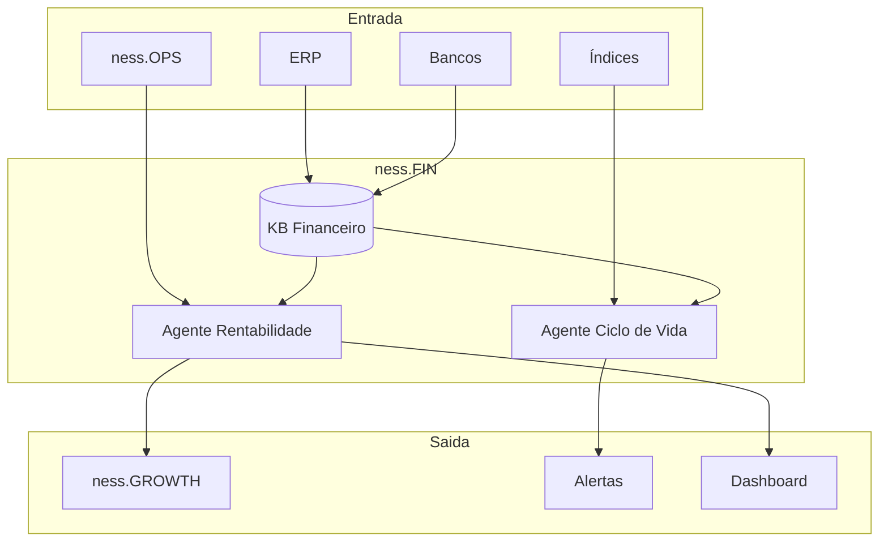

# ness.FIN

> CFO Digital e Gestão de Contratos

## Visão Geral

O ness.FIN atua como um **CFO Digital**, focado na saúde financeira e rentabilidade da operação. Com perfil analítico e preditivo, cruza dados de receita e despesa em tempo real para garantir previsibilidade e decisões financeiras baseadas em dados.

## Objetivos

- Conectar-se ao ERP para visão financeira em tempo real
- Apurar custo real e rentabilidade por contrato
- Calcular overhead médio para precificação
- Automatizar gestão do ciclo de vida contratual
- Garantir previsibilidade financeira

## Componentes

### Agentes

| Agente | Função | Tipo |
|--------|--------|------|
| [Agente de Rentabilidade](../agents/agents-specification.md#6-agente-de-rentabilidade) | Calcular margens | Analítico |
| [Agente de Ciclo de Vida](../agents/agents-specification.md#7-agente-de-ciclo-de-vida) | Gestão de vigências | Automação |

### Base de Conhecimento

**KB_FINANCEIRO**

| Conteúdo | Fonte | Atualização |
|----------|-------|-------------|
| Dados do ERP | Integração | Diária |
| Tabelas de impostos | Configuração | Mensal |
| Custos de overhead | Cálculo | Mensal |
| Vigências contratuais | Sistema | Contínua |
| Índices econômicos | APIs externas | Diária |

## Funcionalidades

### 1. Integração com ERP (CFO Digital)

Conexão em tempo real com o sistema financeiro.

**Dados coletados:**

| Dado | Fonte ERP | Frequência |
|------|-----------|------------|
| Receita por contrato | Faturamento | Diária |
| Despesas diretas | Contas a pagar | Diária |
| Folha de pagamento | RH/Contabilidade | Mensal |
| Impostos pagos | Fiscal | Mensal |
| Fluxo de caixa | Tesouraria | Diária |

### 2. Gestão de Custos e Rentabilidade

Apuração detalhada do custo real por contrato.

**Componentes do custo:**

```
Custo_Total = Custo_RH + Custo_Ferramentas + Custo_Cloud + Impostos + Rateio_Overhead

Onde:
- Custo_RH = Horas × Custo/hora do técnico alocado
- Custo_Ferramentas = Licenças utilizadas no contrato
- Custo_Cloud = Consumo de infraestrutura
- Impostos = Receita × %Impostos específicos
- Rateio_Overhead = Receita × %Overhead calculado
```

**Cálculo do Overhead:**

```
%Overhead = (Custos_Fixos_Totais / Receita_Total) × 100

Custos Fixos incluem:
- Aluguel e infraestrutura
- Administrativo (RH, Financeiro, etc.)
- Marketing institucional
- Ferramentas corporativas
- Depreciação
```

**Output de Rentabilidade:**

```json
{
  "contrato_id": "CTR-2025-001",
  "periodo": "2025-01",
  "receita": 50000.00,
  "custos": {
    "rh": 20000.00,
    "ferramentas": 3000.00,
    "cloud": 5000.00,
    "impostos": 8500.00,
    "overhead": 7500.00
  },
  "custo_total": 44000.00,
  "margem_liquida": 6000.00,
  "rentabilidade_percent": 12.0
}
```

### 3. Ciclo de Vida do Contrato

Automação completa da gestão de vigências.

**Eventos monitorados:**

| Evento | Antecedência | Ação Automática |
|--------|--------------|-----------------|
| Fim de vigência | 90 dias | Alerta para comercial |
| Fim de vigência | 60 dias | E-mail para cliente |
| Fim de vigência | 30 dias | Proposta de renovação |
| Reajuste anual | 30 dias | Cálculo + Notificação cliente |
| Inadimplência | 15 dias | Alerta financeiro |
| Inadimplência | 30 dias | Notificação de suspensão |

**Cálculo de Reajuste:**

```
Valor_Reajustado = Valor_Atual × (1 + Indice_Acumulado_12m)

Índices suportados:
- IGPM (FGV) - padrão para contratos de TI
- IPCA (IBGE) - alternativa mais estável
- INPC (IBGE) - para contratos específicos
```

### 4. Projeções e Forecast

Previsibilidade financeira baseada em histórico.

**Análises disponíveis:**

| Análise | Horizonte | Inputs |
|---------|-----------|--------|
| Receita projetada | 12 meses | Contratos vigentes + renovações |
| Custos projetados | 12 meses | Histórico + tendências |
| Cash flow | 90 dias | Recebíveis + pagáveis |
| Churn risk | 6 meses | Rentabilidade + satisfação |

## Integrações

### Entrada

| Sistema | Dados | Protocolo |
|---------|-------|-----------|
| ERP | Receita, despesas | API/DB |
| ness.OPS | Recursos consumidos | API |
| Bancos | Extratos | API/OFX |
| IBGE/FGV | Índices econômicos | API |

### Saída

| Destino | Dados | Protocolo |
|---------|-------|-----------|
| ness.GROWTH | Custos, overhead | API |
| E-mail | Alertas, notificações | SMTP |
| Dashboard | Métricas financeiras | WebSocket |

## Métricas do Módulo

| KPI | Meta | Frequência |
|-----|------|------------|
| Margem líquida média | > 15% | Mensal |
| Contratos com prejuízo | 0% | Mensal |
| Alertas de vencimento cumpridos | 100% | Contínuo |
| Reajustes aplicados no prazo | 100% | Anual |
| Acurácia de forecast | > 90% | Trimestral |

## Alertas Configuráveis

| Condição | Nível | Destinatários |
|----------|-------|---------------|
| Rentabilidade < 10% | Crítico | Diretoria |
| Rentabilidade < 20% | Atenção | Gerente Comercial |
| Custo > Receita | Emergência | Diretoria + Comercial |
| Inadimplência > 30 dias | Alto | Financeiro + Comercial |
| Vencimento < 30 dias | Médio | Comercial |

## Fluxo de Dados



## Considerações de Implementação

### Segurança

- Dados financeiros são **criptografados** em repouso e trânsito
- Acesso restrito por **RBAC** rigoroso
- **Audit trail** completo de todas as operações
- Integração com ERP via **credenciais seguras** (vault)

### Conformidade

- Relatórios compatíveis com **padrões contábeis**
- Rastreabilidade para **auditoria fiscal**
- Documentação de cálculos para **compliance**
