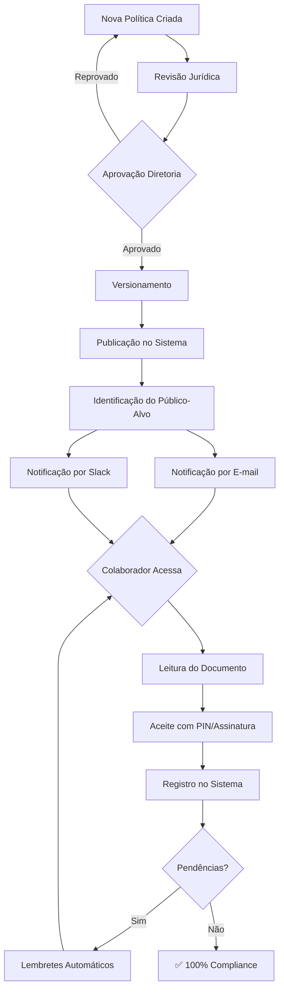

# ness.GOV

> Governança Corporativa Interna

## Visão Geral

O ness.GOV é responsável por manter a **"casa em ordem"**. Centraliza a gestão de políticas internas, rastreia aceites de documentos e garante que todos os colaboradores estejam em conformidade com as normas da empresa.

## Objetivos

- Centralizar criação e distribuição de políticas
- Rastrear aceites de documentos por colaborador
- Garantir compliance interno
- Automatizar onboarding documental
- Manter histórico auditável de conformidade

## Componentes

### Agentes

| Agente | Função | Tipo |
|--------|--------|------|
| [Agente de Compliance](../agents/agents-specification.md#9-agente-de-compliance) | Rastrear aceites | Monitoramento |

### Base de Conhecimento

**KB_GOVERNANCA**

| Conteúdo | Fonte | Atualização |
|----------|-------|-------------|
| Políticas internas | Documentação | Manual |
| NDAs e termos | Templates | Manual |
| Documentos de onboarding | RH | Manual |
| Registros de aceite | Sistema | Automática |
| Histórico de versões | Versionamento | Automática |

## Funcionalidades

### 1. Gestão de Políticas

Ciclo de vida completo de políticas corporativas.

**Tipos de políticas:**

| Política | Público | Renovação |
|----------|---------|-----------|
| Política de Segurança da Informação | Todos | Anual ou atualização |
| Política de Privacidade (LGPD) | Todos | Atualização |
| Código de Conduta | Todos | Anual |
| Política de Uso Aceitável | Todos | Anual |
| Política de Trabalho Remoto | Elegíveis | Anual |
| Política de Senhas | Todos | Atualização |

**Ciclo de vida:**

```
1. Criação/Revisão da política
2. Aprovação pela diretoria
3. Versionamento (v1.0, v1.1, v2.0...)
4. Distribuição automática
5. Coleta de aceites
6. Monitoramento de pendências
7. Arquivamento de versões antigas
```

### 2. Rastreabilidade de Aceites

Controle completo de quem aceitou o quê e quando.

**Documentos rastreados:**

| Documento | Momento | Validade | Renovação |
|-----------|---------|----------|-----------|
| NDA | Admissão | 12 meses | Anual |
| Política de Segurança | Admissão | Até nova versão | Atualização |
| Código de Conduta | Admissão | 12 meses | Anual |
| Termo LGPD | Admissão | Até nova versão | Atualização |
| Termo de Equipamentos | Admissão | Até devolução | Devolução |
| Termo de Acesso Remoto | Quando aplicável | 12 meses | Anual |

**Registro de aceite:**

```json
{
  "aceite_id": "ACE-2025-00123",
  "colaborador_id": "COL-001",
  "colaborador_nome": "João Silva",
  "documento": "Política de Segurança da Informação",
  "versao": "v2.1",
  "data_aceite": "2025-01-15T14:30:00Z",
  "ip_origem": "192.168.1.100",
  "user_agent": "Mozilla/5.0 Chrome/120",
  "geolocalizacao": "São Paulo, BR",
  "hash_documento": "sha256:abc123def456...",
  "assinatura_digital": true,
  "metodo": "Checkbox + PIN",
  "valido_ate": "2026-01-15"
}
```

### 3. Onboarding Documental

Fluxo automatizado para novos colaboradores.

**Checklist de onboarding:**

```
□ Contrato de trabalho assinado
□ NDA assinado
□ Política de Segurança aceita
□ Código de Conduta aceito
□ Termo LGPD aceito
□ Termo de Equipamentos aceito
□ Cadastro biométrico (se aplicável)
□ Foto para crachá
□ Documentos pessoais digitalizados
```

**Status de onboarding:**

| Status | Descrição | Ação |
|--------|-----------|------|
| 🟢 Completo | Todos os documentos OK | Liberado |
| 🟡 Pendente | Documentos faltando | Lembrete automático |
| 🔴 Crítico | Prazo excedido | Escalonamento RH |

### 4. Dashboard de Compliance

Visão consolidada do status de governança.

**Métricas exibidas:**

| Métrica | Visualização |
|---------|--------------|
| % de colaboradores em compliance | Gauge |
| Documentos pendentes por área | Gráfico de barras |
| Vencimentos próximos (30 dias) | Lista |
| Histórico de aceites | Timeline |
| Políticas com baixa adesão | Alerta |

### 5. Alertas e Notificações

Sistema automatizado de lembretes.

**Régua de comunicação:**

| Evento | Antecedência | Canal | Destinatário |
|--------|--------------|-------|--------------|
| Vencimento de aceite | 30 dias | E-mail | Colaborador |
| Vencimento de aceite | 15 dias | E-mail + Slack | Colaborador |
| Vencimento de aceite | 7 dias | E-mail + Slack | Colaborador + Gestor |
| Aceite vencido | 0 dias | E-mail + Slack | Colaborador + Gestor + RH |
| Nova política publicada | Imediato | E-mail + Slack | Público-alvo |

## Integrações

### Entrada

| Sistema | Dados | Protocolo |
|---------|-------|-----------|
| RH | Lista de colaboradores | API |
| Active Directory | Status de conta | LDAP |
| Interface Web | Aceites | HTTPS |

### Saída

| Destino | Dados | Protocolo |
|---------|-------|-----------|
| ness.PEOPLE | Status de compliance | API |
| E-mail | Notificações | SMTP |
| Slack | Alertas | Webhook |
| Dashboard | Métricas | WebSocket |

## Métricas do Módulo

| KPI | Meta | Frequência |
|-----|------|------------|
| Taxa de compliance geral | > 98% | Contínuo |
| Onboardings completos em 5 dias | > 95% | Por admissão |
| Tempo médio para aceite de nova política | < 7 dias | Por política |
| Documentos com aceite vencido | 0 | Contínuo |

## Fluxo de Distribuição de Política



## Considerações de Implementação

### Segurança e Validade Jurídica

- Aceites com **timestamp** de servidor confiável
- **Hash do documento** no momento do aceite
- Opção de **assinatura digital** (ICP-Brasil)
- **Logs imutáveis** para auditoria
- Conformidade com **MP 2.200-2** (validade jurídica)

### LGPD

- Dados de aceite são dados pessoais
- Prazo de retenção definido por política
- Direito de acesso pelo colaborador
- Anonimização após desligamento (quando aplicável)
