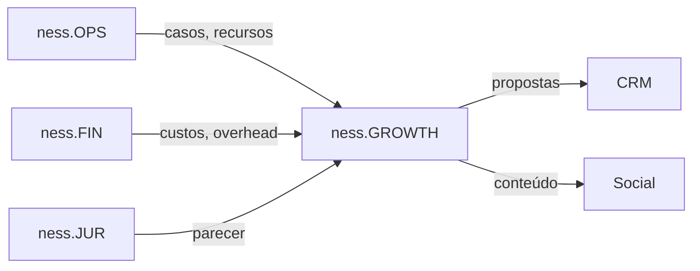

# ness.GROWTH

> Inteligência Comercial e Marketing

## Visão Geral

O ness.GROWTH é o módulo responsável por **vendas inteligentes** e **presença de marca**. A IA opera em sua capacidade generativa e analítica máxima, utilizando bases de conhecimento históricas para criar novos ativos comerciais.

## Objetivos

- Automatizar geração de propostas técnicas
- Precificar considerando custos reais e riscos
- Gerar conteúdo de marketing baseado em casos de sucesso
- Monitorar e otimizar presença digital

## Componentes

### Agentes

| Agente | Função | Tipo |
|--------|--------|------|
| [Agente de Vendas](../agents/agents-specification.md#1-agente-de-vendas-smart-proposals) | Gerar propostas técnicas | Generativo |
| [Agente de Precificação](../agents/agents-specification.md#2-agente-de-precificação) | Calcular preços | Analítico |
| [Agente de Marketing](../agents/agents-specification.md#3-agente-de-marketing) | Criar conteúdo | Generativo |

### Base de Conhecimento

**KB_COMERCIAL**

| Conteúdo | Fonte | Atualização |
|----------|-------|-------------|
| Contratos de sucesso | ness.OPS | Evento |
| Histórico de propostas | CRM | Contínua |
| Cases (ex: Alupar) | Documentação | Manual |
| Templates de proposta | Documentação | Manual |

## Funcionalidades

### 1. Smart Proposals

Geração automatizada de propostas técnicas baseadas em histórico.

**Fluxo:**
```
Briefing → Busca RAG → Modelo Ideal → Adaptação → Precificação → Proposta Final
```

**Entradas:**
- Dados do prospect (porte, setor, necessidades)
- Escopo desejado
- Prazo de entrega

**Saídas:**
- Proposta técnica em PDF/DOCX
- Precificação detalhada
- Timeline de implementação

### 2. Precificação Inteligente

Cálculo de preços considerando custos reais e riscos contratuais.

**Fórmula:**
```
Preço = (Custo_Direto × (1 + %Overhead)) × (1 + %Margem) × (1 + %Risco_SLA)
```

**Fontes de dados:**
- ness.OPS: Consumo de recursos
- ness.FIN: Overhead e impostos
- Tabela de SLA: Riscos por nível de serviço

### 3. Monitoramento de Upsell

Identificação de oportunidades na base de clientes.

**Triggers de oportunidade:**
- Cliente estourando horas contratadas
- Uso de storage acima de 80%
- Crescimento do ambiente monitorado
- Solicitações fora do escopo

### 4. Marketing de Conteúdo

Geração automatizada de conteúdo para redes sociais e site.

**Tipos de conteúdo:**

| Tipo | Canal | Frequência |
|------|-------|------------|
| Case Study | LinkedIn + Blog | Quinzenal |
| Thought Leadership | LinkedIn | Semanal |
| Insights Operacionais | Instagram | 2x/semana |
| Artigos Técnicos | Blog | Mensal |

**Monitoramento:**
- Métricas de engajamento
- Análise de comentários
- Sugestão de respostas
- Identificação de temas trending

## Integrações

### Entrada

| Sistema | Dados | Protocolo |
|---------|-------|-----------|
| ness.OPS | Casos de sucesso | API |
| ness.FIN | Custos e overhead | API |
| CRM | Oportunidades | Webhook |

### Saída

| Sistema | Dados | Protocolo |
|---------|-------|-----------|
| LinkedIn | Posts | API |
| Instagram | Posts | API |
| Site | Artigos | CMS API |
| E-mail | Propostas | SMTP |

## Métricas

| KPI | Meta | Frequência |
|-----|------|------------|
| Taxa de conversão de propostas | > 30% | Mensal |
| Tempo médio de geração de proposta | < 2h | Por proposta |
| Engajamento em redes sociais | +10% MoM | Mensal |
| Upsell identificado | > 5/mês | Mensal |

## Dependências


