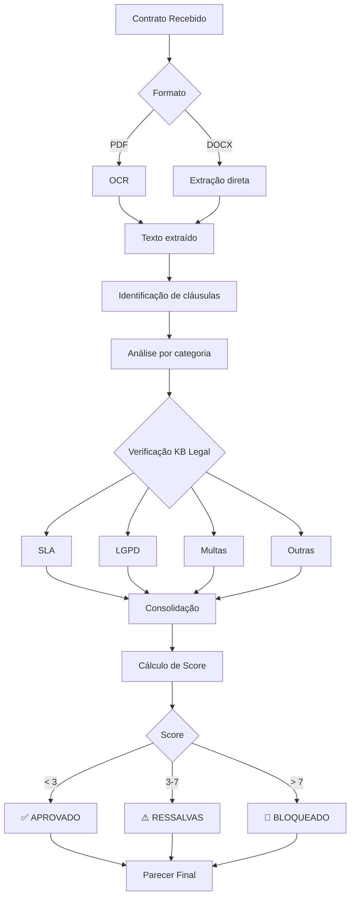

# ness.JUR

> Blindagem e Conformidade Legal

## Visão Geral

O ness.JUR atua como **guardião jurídico** da operação, utilizando NLP para análise de contratos e verificação de conformidade legal. Seu objetivo é identificar riscos jurídicos antes que se tornem problemas.

## Objetivos

- Analisar cláusulas contratuais em busca de riscos
- Verificar conformidade com legislação vigente
- Identificar SLAs desproporcionais e penalidades abusivas
- Fornecer pareceres jurídicos automatizados
- Manter base atualizada de legislação relevante

## Componentes

### Agentes

| Agente | Função | Tipo |
|--------|--------|------|
| [Agente de Análise Contratual](../agents/agents-specification.md#8-agente-de-análise-contratual) | Identificar riscos | NLP/Analítico |

### Base de Conhecimento

**KB_LEGAL**

| Conteúdo | Fonte | Atualização |
|----------|-------|-------------|
| LGPD | Legislação oficial | Manual |
| Marco Civil da Internet | Legislação oficial | Manual |
| CLT | Legislação oficial | Manual |
| Cláusulas padrão ness. | Templates | Manual |
| Jurisprudência relevante | Pesquisa | Periódica |

## Funcionalidades

### 1. Análise de Contratos

Varredura automatizada de documentos contratuais.

**Categorias analisadas:**

| Categoria | Verificações | Risco |
|-----------|--------------|-------|
| **SLA** | Prazos de atendimento, uptime garantido | Alto |
| **Multas** | Valores, condições, limitações | Alto |
| **LGPD** | Tratamento de dados, DPO, transferência | Crítico |
| **Rescisão** | Condições, prazos, multas | Médio |
| **PI** | Propriedade intelectual, cessão | Alto |
| **Foro** | Jurisdição, arbitragem | Médio |
| **Responsabilidade** | Limitações, exclusões | Alto |

**Processo de análise:**

```
1. Upload do documento (PDF/DOCX)
2. Extração de texto via OCR se necessário
3. Identificação de cláusulas por categoria
4. Comparação com templates padrão
5. Verificação contra legislação (KB Legal)
6. Cálculo de score de risco
7. Geração de parecer
```

### 2. Identificação de Riscos

**Padrões de risco detectados:**

| Padrão | Exemplo | Severidade |
|--------|---------|------------|
| SLA inviável | "Atendimento em 15 minutos 24x7" | Alta |
| Multa desproporcional | "Multa de 100% do contrato por atraso" | Alta |
| Cláusula leonina | "Rescisão unilateral sem aviso" | Crítica |
| Ausência de LGPD | Sem menção a tratamento de dados | Crítica |
| Foro desfavorável | "Foro de comarca distante" | Média |
| Responsabilidade ilimitada | "Responsabilidade integral por danos" | Alta |

**Output de análise:**

```json
{
  "contrato": "Contrato_Cliente_X.pdf",
  "data_analise": "2025-01-29",
  "status": "RESSALVAS",
  "score_risco": 7.5,
  "riscos": [
    {
      "categoria": "SLA",
      "clausula": "5.2",
      "texto_original": "O CONTRATADO deverá atender chamados críticos em até 30 minutos...",
      "risco": "Prazo de 30min para incidentes críticos é inviável operacionalmente",
      "severidade": "ALTA",
      "sugestao": "Negociar para 2h úteis com escalonamento",
      "fundamentacao": "Prática de mercado para serviços gerenciados"
    },
    {
      "categoria": "LGPD",
      "clausula": "8.1",
      "texto_original": "Os dados serão tratados conforme necessidade...",
      "risco": "Ausência de especificação de finalidade de tratamento",
      "severidade": "CRÍTICA",
      "sugestao": "Incluir cláusula detalhada de tratamento conforme Art. 7º da LGPD",
      "fundamentacao": "Lei 13.709/2018, Art. 7º"
    }
  ],
  "clausulas_ok": 15,
  "clausulas_atencao": 3,
  "clausulas_criticas": 2
}
```

### 3. Conformidade Legal

Verificação contínua contra legislação vigente.

**Leis monitoradas:**

| Lei | Aplicação | Verificações |
|-----|-----------|--------------|
| **LGPD** (13.709/2018) | Tratamento de dados | Finalidade, consentimento, DPO |
| **Marco Civil** (12.965/2014) | Internet | Guarda de logs, neutralidade |
| **CLT** | Trabalhista | Terceirização, responsabilidade |
| **CDC** | Consumidor | Cláusulas abusivas |
| **Lei de Licitações** | Público | Requisitos específicos |

### 4. Templates e Sugestões

Biblioteca de cláusulas padrão aprovadas.

**Templates disponíveis:**

| Tipo | Uso | Status |
|------|-----|--------|
| Cláusula SLA padrão | Contratos de serviço | Aprovado |
| Cláusula LGPD | Todos os contratos | Aprovado |
| Cláusula de Confidencialidade | Todos os contratos | Aprovado |
| Cláusula de Rescisão | Contratos de serviço | Aprovado |
| Cláusula de PI | Projetos | Aprovado |

## Integrações

### Entrada

| Sistema | Dados | Protocolo |
|---------|-------|-----------|
| Upload manual | Contratos novos | Interface |
| ness.GROWTH | Propostas para revisão | API |
| E-mail | Contratos de clientes | IMAP |

### Saída

| Destino | Dados | Protocolo |
|---------|-------|-----------|
| ness.GROWTH | Parecer jurídico | API |
| E-mail | Alertas de risco | SMTP |
| Dashboard | Status de análises | WebSocket |

## Métricas do Módulo

| KPI | Meta | Frequência |
|-----|------|------------|
| Contratos analisados antes de assinatura | 100% | Contínuo |
| Tempo médio de análise | < 24h | Por contrato |
| Riscos críticos identificados | 100% recall | Contínuo |
| False positives | < 10% | Mensal |

## Fluxo de Análise



## Considerações de Implementação

### NLP e IA

- Modelo treinado em corpus jurídico brasileiro
- Fine-tuning com contratos de TI/Cybersecurity
- Atualização contínua com novos casos

### Limitações

- **Não substitui** parecer de advogado para casos complexos
- Recomendado **revisão humana** para contratos de alto valor
- Score de risco é **indicativo**, não definitivo
