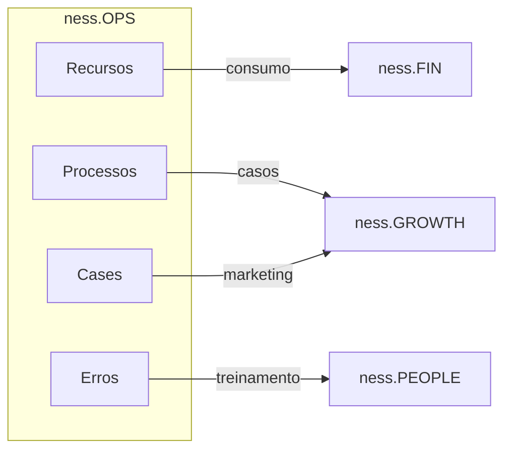

# ness.OPS

> Gestão do Conhecimento e Operação

## Visão Geral

O ness.OPS é o **coração operacional** do ness.OS. Responsável por padronizar processos, mapear recursos e alimentar os demais módulos com dados reais da operação. A IA atua organizando o caos operacional e transformando-o em conhecimento estruturado.

## Objetivos

- Mapear e padronizar processos operacionais
- Homogeneizar qualidade de serviço entre contratos
- Medir consumo exato de recursos por contrato
- Gerar manuais de procedimentos detalhados
- Alimentar outros módulos com dados operacionais

## Componentes

### Agentes

| Agente | Função | Tipo |
|--------|--------|------|
| [Agente de Homogeneização](../agents/agents-specification.md#4-agente-de-homogeneização) | Padronizar processos | Estruturador |
| [Agente de Mapeamento](../agents/agents-specification.md#5-agente-de-mapeamento-de-recursos) | Medir recursos | Coletor |

### Base de Conhecimento

**KB_OPERACIONAL**

| Conteúdo | Fonte | Atualização |
|----------|-------|-------------|
| Rituais técnicos | Documentação | Manual |
| Manuais de procedimentos | Gerado | Automática |
| Consumo de recursos | Coleta | Diária |
| Contratos vigentes | Sistema | Contínua |
| Erros operacionais | Logs | Evento |

## Funcionalidades

### 1. Engenharia de Processos

Mapeamento e padronização de procedimentos técnicos.

**Rituais Mapeados:**

| Categoria | Procedimentos | Frequência |
|-----------|---------------|------------|
| **Backup** | Full backup, Incremental, Teste de restore | Diário/Semanal/Mensal |
| **Patch Management** | Avaliação, Homologação, Deploy, Rollback | Mensal |
| **Firewall** | Revisão de regras, Análise de logs, Tunning | Semanal |
| **Monitoramento** | Revisão de alertas, Ajuste de thresholds | Diário |
| **Incidentes** | Triagem, Escalonamento, RCA | Evento |

**Processo de Padronização:**
```
1. Coleta de processos existentes por contrato
2. Análise de variações e inconsistências
3. Definição do "padrão ouro"
4. Geração do Manual de Procedimento
5. Distribuição para times
6. Monitoramento de aderência
```

### 2. Mapeamento de Recursos

Medição exata do consumo de recursos por contrato.

**Recursos Rastreados:**

| Recurso | Fonte | Granularidade |
|---------|-------|---------------|
| Horas técnicas | Timesheet | Por tarefa |
| Licenças de software | Inventário | Por usuário |
| Compute (cloud) | AWS/Azure/GCP APIs | Por hora |
| Storage (cloud) | AWS/Azure/GCP APIs | Por GB |
| Ferramentas SaaS | Billing APIs | Por licença |

**Output:**
```json
{
  "contrato_id": "CTR-2025-001",
  "periodo": "2025-01",
  "recursos": {
    "horas_tecnicas": {
      "total": 120,
      "por_categoria": {
        "incidentes": 40,
        "mudancas": 50,
        "projetos": 30
      }
    },
    "licencas": {
      "wazuh_agents": 150,
      "zabbix_hosts": 200
    },
    "cloud": {
      "compute_hours": 720,
      "storage_gb": 500
    }
  }
}
```

### 3. Ingestão de Indicadores

Coleta e consolidação de métricas de performance.

**Fontes de dados:**
- APIs de ferramentas de monitoramento
- Relatórios de ITSM
- Timesheet
- Inserção manual

**Indicadores coletados:**

| Indicador | Fonte | SLA Típico |
|-----------|-------|------------|
| MTTR | ITSM | < 4h |
| Disponibilidade | Monitoramento | > 99.5% |
| Incidentes/mês | ITSM | < 10 críticos |
| Backlog de chamados | ITSM | < 20 |
| Aderência a processos | Auditorias | > 95% |

### 4. Gestão de Casos de Sucesso

Documentação estruturada de entregas bem-sucedidas.

**Template de caso:**
```markdown
## Caso: [Nome do Cliente] - [Projeto]

### Desafio
[Descrição do problema ou necessidade]

### Solução
[O que foi implementado]

### Resultados
- [Métrica 1]: [Valor antes] → [Valor depois]
- [Métrica 2]: [Valor antes] → [Valor depois]

### Tecnologias
- [Lista de ferramentas utilizadas]

### Duração
[Tempo de implementação]
```

## Integrações

### Entrada

| Sistema | Dados | Protocolo |
|---------|-------|-----------|
| Timesheet | Horas trabalhadas | API |
| AWS/Azure/GCP | Consumo cloud | API |
| ITSM | Chamados, incidentes | API |
| Monitoramento | Métricas | API |

### Saída

| Destino | Dados | Protocolo |
|---------|-------|-----------|
| ness.FIN | Recursos consumidos | API |
| ness.GROWTH | Casos de sucesso | API |
| ness.PEOPLE | Erros operacionais | Event |

## Métricas do Módulo

| KPI | Meta | Frequência |
|-----|------|------------|
| Cobertura de processos documentados | 100% | Trimestral |
| Aderência ao padrão | > 95% | Mensal |
| Tempo de coleta de recursos | < 24h | Diário |
| Casos de sucesso documentados | > 2/mês | Mensal |

## Fluxos de Saída



## Considerações de Implementação

### Coleta de Dados

- **Automática:** Priorizar APIs para dados de cloud e monitoramento
- **Semi-automática:** Timesheet com validação
- **Manual:** Casos de sucesso e documentação de processos

### Armazenamento

- **Vector DB:** Para busca semântica em manuais e casos
- **SQL:** Para dados estruturados de recursos
- **Object Storage:** Para documentos e anexos
