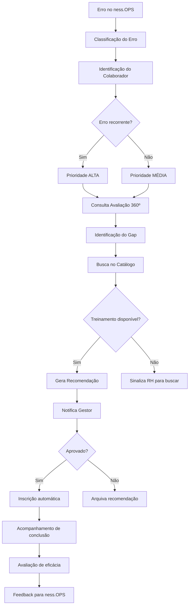

# ness.PEOPLE

> Gestão de Talentos

## Visão Geral

O ness.PEOPLE é o módulo de **gestão de pessoas** do ness.OS, focado em desempenho, desenvolvimento e **recrutamento**. Sua inovação principal é a integração entre falhas operacionais e desenvolvimento humano, fechando o ciclo de aprendizado organizacional.

**Integração com site institucional:** O painel de vagas do site (job_openings, candidaturas, templates) é agregado ao ness.PEOPLE. Ver [plan-integracao-nessos-site-institucional](../plan-integracao-nessos-site-institucional.md). Rota `/people/jobs`.

## Objetivos

- Consolidar avaliações de desempenho (360º)
- Correlacionar erros operacionais com necessidades de treinamento
- Fornecer visão de liderança sobre times
- Automatizar recomendações de desenvolvimento
- Integrar dados qualitativos e quantitativos de performance

## Componentes

### Agentes

| Agente | Função | Tipo |
|--------|--------|------|
| [Agente de Correlação](../agents/agents-specification.md#10-agente-de-correlação-de-treinamento) | Recomendar treinamentos | Analítico |

### Base de Conhecimento

**KB_PESSOAS**

| Conteúdo | Fonte | Atualização |
|----------|-------|-------------|
| Avaliações 360º | Sistema de RH | Ciclo de avaliação |
| Feedback qualitativo | Pesquisas | Periódica |
| Erros operacionais | ness.OPS | Evento |
| Catálogo de treinamentos | Configuração | Manual |
| Histórico de capacitação | Sistema | Contínua |

## Funcionalidades

### 1. Avaliação 360º

Coleta e consolidação de avaliações de múltiplas fontes.

**Fontes de avaliação:**

| Fonte | Peso | Frequência |
|-------|------|------------|
| Autoavaliação | 15% | Semestral |
| Gestor direto | 40% | Semestral |
| Pares (colegas) | 25% | Semestral |
| Clientes internos | 20% | Semestral |

**Competências avaliadas:**

| Categoria | Competências |
|-----------|--------------|
| **Técnicas** | Conhecimento específico, Resolução de problemas, Qualidade técnica |
| **Comportamentais** | Comunicação, Trabalho em equipe, Proatividade |
| **Liderança** | Gestão de pessoas, Tomada de decisão, Desenvolvimento de equipe |
| **Resultados** | Entrega, Cumprimento de prazos, Atingimento de metas |

**Output de avaliação:**

```json
{
  "colaborador_id": "COL-001",
  "ciclo": "2024-S2",
  "scores": {
    "tecnicas": {
      "conhecimento": 4.2,
      "resolucao_problemas": 3.8,
      "qualidade": 4.0
    },
    "comportamentais": {
      "comunicacao": 3.5,
      "trabalho_equipe": 4.5,
      "proatividade": 4.0
    },
    "resultados": {
      "entrega": 4.3,
      "prazos": 3.7,
      "metas": 4.1
    }
  },
  "score_geral": 4.0,
  "pontos_fortes": ["Trabalho em equipe", "Entrega"],
  "areas_desenvolvimento": ["Comunicação", "Prazos"],
  "feedbacks_qualitativos": [
    "Excelente colaborador técnico, precisa melhorar comunicação com clientes"
  ]
}
```

### 2. Análise de Liderança

Visão consolidada para gestores sobre seus times.

**Métricas de time:**

| Métrica | Descrição |
|---------|-----------|
| Score médio do time | Média das avaliações |
| Distribuição de performance | Curva do time |
| Turnover risk | Colaboradores em risco |
| Gaps de competência | Áreas fracas do time |
| Evolução histórica | Comparativo entre ciclos |

**Dashboard do gestor:**

```
┌─────────────────────────────────────────────────────────────┐
│ Time: Operações SOC                                         │
├─────────────────────────────────────────────────────────────┤
│ Score Médio: 4.1 ★★★★☆                                      │
│                                                             │
│ Distribuição:                                               │
│ ████████████████ Excepcional (20%)                         │
│ ████████████████████████████ Atende+ (50%)                 │
│ ████████████ Atende (25%)                                  │
│ ██ Abaixo (5%)                                             │
│                                                             │
│ Gaps do Time:          │ Destaques:                        │
│ • Documentação técnica │ • Resposta a incidentes           │
│ • Gestão de tempo      │ • Conhecimento de ferramentas     │
└─────────────────────────────────────────────────────────────┘
```

### 3. Correlação de Treinamento

Cruzamento automático entre erros e capacitação.

**Matriz de correlação:**

| Tipo de Erro (OPS) | Competência | Treinamento Sugerido |
|--------------------|-------------|---------------------|
| Falha em backup | Processos de DR | Backup & Recovery |
| Breach de segurança | Security awareness | Segurança + LGPD |
| SLA não cumprido | Gestão de tempo | Priorização |
| Documentação incompleta | Comunicação técnica | Redação técnica |
| Erro de configuração | Conhecimento técnico | Certificação específica |
| Falha de comunicação | Soft skills | Comunicação assertiva |

**Fluxo de correlação:**

```
1. Erro detectado no ness.OPS
2. Classificação do tipo de erro
3. Identificação do(s) colaborador(es)
4. Consulta histórico de erros similares
5. Consulta avaliação 360º atual
6. Identificação do gap de competência
7. Busca no catálogo de treinamentos
8. Geração de recomendação
9. Notificação para gestor e colaborador
```

**Output de recomendação:**

```json
{
  "recomendacao_id": "REC-2025-0042",
  "colaborador_id": "COL-001",
  "data": "2025-01-29",
  "origem": {
    "tipo": "Erro operacional",
    "referencia": "ERR-2025-0108",
    "descricao": "Falha no procedimento de patch em servidor crítico"
  },
  "gap_identificado": "Patch Management",
  "evidencias": [
    "Erro ERR-2025-0108: Procedimento incorreto",
    "Avaliação 360º: Score 3.2 em 'Processos'"
  ],
  "treinamento": {
    "nome": "Patch Management para Ambientes Críticos",
    "carga_horaria": "16h",
    "modalidade": "Online síncrono",
    "fornecedor": "SANS Institute",
    "custo_estimado": 2500.00
  },
  "prioridade": "ALTA",
  "prazo_conclusao": "2025-03-31",
  "status": "Pendente aprovação"
}
```

### 4. Catálogo de Treinamentos

Base de cursos disponíveis para desenvolvimento.

**Estrutura do catálogo:**

| Campo | Descrição |
|-------|-----------|
| Nome | Título do treinamento |
| Competências | Quais competências desenvolve |
| Carga horária | Duração |
| Modalidade | Presencial, Online, Híbrido |
| Fornecedor | Interno ou externo |
| Custo | Valor por participante |
| Pré-requisitos | Se houver |
| Certificação | Se oferece certificado |

### 5. Recrutamento e Vagas (integr. site institucional)

Gestão de vagas, candidaturas e pipeline de talentos — agregado do admin do site institucional.

**Escopo:**
- CRUD job_openings (vagas abertas)
- Templates de descrição de vagas
- Candidaturas (job_applications), stakeholders, comentários
- Site institucional exibe vagas em modo read-only (consumo do schema `people`)

**Tabelas:** people.job_openings, people.job_opening_translations, people.job_departments, people.job_applications (ou equivalente).

**Rota:** `/people/jobs`

### 6. Plano de Desenvolvimento Individual (PDI)

Consolidação de todas as recomendações em um plano estruturado.

**Estrutura do PDI:**

```
┌─────────────────────────────────────────────────────────────┐
│ PDI 2025 - João Silva                                       │
├─────────────────────────────────────────────────────────────┤
│ Objetivo de Carreira: Especialista em Segurança Ofensiva   │
│                                                             │
│ Gaps Identificados:                                         │
│ 1. Certificação OSCP (técnico)                             │
│ 2. Comunicação com clientes (comportamental)               │
│ 3. Documentação técnica (processo)                         │
│                                                             │
│ Plano de Ação:                                              │
│ ┌─────────────────┬───────────┬────────────┬──────────┐    │
│ │ Ação            │ Prazo     │ Investimento│ Status   │    │
│ ├─────────────────┼───────────┼────────────┼──────────┤    │
│ │ Curso OSCP Prep │ Q1/2025   │ R$ 5.000   │ ⏳ Em and.│    │
│ │ Workshop Comunic│ Q2/2025   │ R$ 800     │ 📅 Agenda│    │
│ │ Mentoria Doc    │ Contínuo  │ Interno    │ ✅ Ativo │    │
│ └─────────────────┴───────────┴────────────┴──────────┘    │
│                                                             │
│ Acompanhamento: Mensal com gestor                          │
└─────────────────────────────────────────────────────────────┘
```

## Integrações

### Entrada

| Sistema | Dados | Protocolo |
|---------|-------|-----------|
| ness.OPS | Erros operacionais | Event |
| ness.GOV | Status de compliance | API |
| RH | Dados de colaboradores | API |
| Sistema de Avaliação | Resultados 360º | API |

### Saída

| Destino | Dados | Protocolo |
|---------|-------|-----------|
| E-mail | Recomendações | SMTP |
| Slack | Notificações | Webhook |
| Dashboard | Métricas de time | WebSocket |
| LMS | Inscrições em cursos | API |

## Métricas do Módulo

| KPI | Meta | Frequência |
|-----|------|------------|
| Taxa de conclusão de PDI | > 80% | Trimestral |
| Redução de erros pós-treinamento | > 50% | Por treinamento |
| Cobertura de avaliação 360º | 100% | Por ciclo |
| Satisfação com treinamentos | > 4.0/5.0 | Por treinamento |
| Tempo médio para fechar gap | < 90 dias | Por gap |

## Fluxo de Correlação



## Considerações de Implementação

### Privacidade

- Dados de avaliação são **confidenciais**
- Acesso restrito ao colaborador, gestor e RH
- Anonimização em relatórios agregados
- Conformidade com **LGPD**

### Ética em IA

- Recomendações são **sugestões**, não decisões
- Viés algorítmico monitorado
- Possibilidade de **contestação** pelo colaborador
- Transparência nos critérios de correlação
